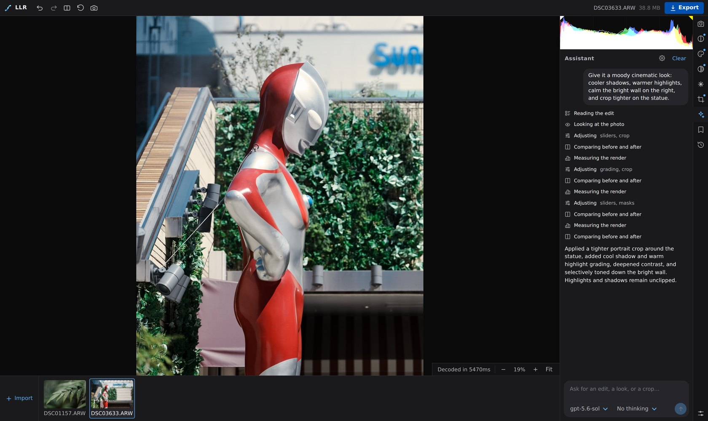

# LLR

LLR is a browser RAW editor for Sony shooters. It renders an ARW the way the
camera did — Creative Look, DRO and all — and lets an LLM agent do the edit from
one sentence.

Two things it does that Lightroom does not:

## The camera's colour, not Adobe's

Three pairs, same crop of the same ARW, swapping in step:


*Left: Sony's own RAW converter (Imaging Edge) ↔ LLR at the same settings.
Middle: camera JPEG ↔ LLR at its defaults. Right: camera JPEG ↔ Lightroom
(Camera FL profile, defaults) — watch the greens lose their colour, the petals
turn, and the whole frame lift.*

Measured (CIEDE2000 mean over the frame, per pixel and after a low-pass that
drops texture and keeps what a flick between the two shows; [method,
per-region tables and a 124-frame sample](docs/readme/colour-fidelity.md)):

| Pair | ΔE00, three frames | ΔE00 low-pass |
|---|---|---|
| Imaging Edge ↔ LLR, same settings | 1.04 / 0.82 / 0.59 | 0.73 / 0.45 / 0.41 |
| Camera JPEG ↔ LLR, defaults | 1.40 / 0.94 / 0.80 | 1.00 / 0.46 / 0.60 |
| Camera JPEG ↔ Lightroom | 2.92 / 5.64 / 6.86 | 2.66 / 5.68 / 6.75 |

Every ARW carries the calibration Imaging Edge renders from: the body's colour
matrix and the tone curve and chroma terms of each Creative Look. LLR reads
them back and runs that pipeline, so what you see first is Sony's own render
— at RAW depth, with every slider still live. On top of that, *camera match*
(a switch) applies what the body's JPEG does that Imaging Edge does not: the
engine's own highlight roll-off without the LUT that costs saturation, and a
fitted correction of a couple of L\* and a few percent of chroma, measured
against the camera's JPEGs. Lightroom's Camera Matching profiles approximate
the same look from a fitted DCP, and saturated colour is where that drifts.

What that buys you, after the shot:

- All of the body's Creative Looks (ST, PT, VV, FL, IN, …) switchable per
  image, with the look's own tweaks on the camera's scale.
- DRO as the camera applied it, or any of Imaging Edge's levels.
- Sony's own RAW-domain noise reduction.

Anything that is not a Sony RAW renders through an Adobe DCP instead, and the
engine is a per-image switch.

## Edit by describing it



The Assistant is an agent with tools over the same state the sliders drive. It
looks at the render, edits (Basic sliders, HSL, colour grading, curves, crop,
masks, Creative Look, DRO, denoise), compares before/after, measures clipping,
and iterates until the intent reads without over-correction. Every change is a
history step: undo it, or take over by hand mid-way. The prompt above cost
$0.40 on `gpt-5.6-sol`. Bring your own key; any provider `pi-ai` knows works.

## Run it

Node 22+, pnpm 10, [uv](https://docs.astral.sh/uv/) for the Python worker,
and a WebGL2 browser.

```bash
pnpm install
pnpm dev        # api on :8790, web on the port Vite prints
```

Drop a RAW on the page. Then, optionally:

- Adobe DCP profiles for non-Sony RAWs: copy `Camera/` from a DNG Converter or
  Lightroom install to `vendor/adobe-camera-profiles/Camera/`.
- The Assistant: export `OPENAI_API_KEY` / `ANTHROPIC_API_KEY` (or another
  provider's usual variable) before `pnpm dev`, then pick the model in the
  panel.
- Everything the server keeps — imports, decode cache — lives under
  `~/.cache/llr` (`LLR_CACHE_DIR`), never in the checkout, and imports stay
  until you remove them from the library.

## More

- [ARCHITECTURE.md](ARCHITECTURE.md) — the three processes and why the
  browser's WebGL pass is the single source of truth for pixels.
- [docs/sony-edit-internals.md](docs/sony-edit-internals.md) and
  [sony_repro/PIPELINE.md](sony_repro/PIPELINE.md) — how the Imaging Edge
  pipeline was recovered, and how faithful each stage is.
- [docs/masking.md](docs/masking.md), [docs/assistant-ux.md](docs/assistant-ux.md)
- `pnpm check` runs typecheck, lint, and the web / api / worker test suites.
